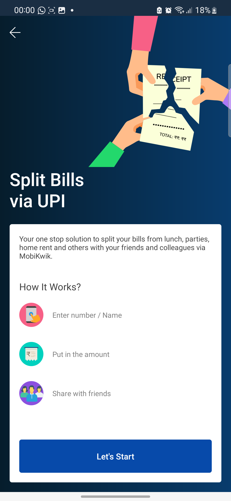
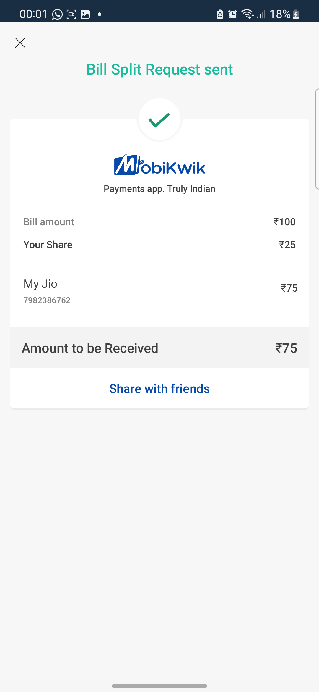
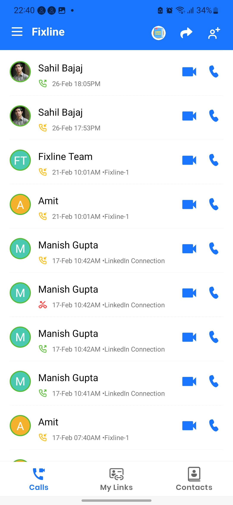

# Mohit Manuja

#### Hello, I'm Mohit, a passionate technologist who is always eager to explore new tools, technologies, and innovative products.

&nbsp;&nbsp;&nbsp;&nbsp;&nbsp;&nbsp;
# Airblack

Airblack | India's premium Platform for Makeup, Beauty and Culinary. 

I successfully developed Airblack from its prototype stage to a fully functional product, comprising of over 10 unique modules. These modules include the Dynamic Home Screen, Workshop Management, Airblack Portfolio Generator, Broadcast Group, Graduation Exam, and Live Chat using SendBird.

##### Technolgies : Kotlin, MVVM Arch, Koin (DI), JAVA, XML, Firebase, SendBird
 

&nbsp;&nbsp;&nbsp;&nbsp;&nbsp;
&nbsp;&nbsp;&nbsp;&nbsp;&nbsp;
&nbsp;&nbsp;&nbsp;&nbsp;&nbsp;

 

&nbsp;&nbsp;&nbsp;&nbsp;&nbsp;
&nbsp;&nbsp;&nbsp;&nbsp;&nbsp;

# Mobikwik

MobiKwik is one of the largest fintech mobile wallets and one of the largest Buy Now Pay Later (BNPL) players in India.

At Mobikwik, I built the Expense Manager to track montly expenses, which allows you to keep an eye on your expenses and plan your budget accordingly. Additionally, I worked on the UPI Split Bill feature, which enables users to split their bills through UPI.

##### Technolgies : Kotlin, MVVM, JAVA, XML, Firebase  
 

&nbsp;&nbsp;&nbsp;&nbsp;&nbsp;
&nbsp;&nbsp;&nbsp;&nbsp;&nbsp;
&nbsp;&nbsp;&nbsp;&nbsp;&nbsp;

&nbsp;&nbsp;&nbsp;&nbsp;&nbsp;
&nbsp;&nbsp;&nbsp;&nbsp;&nbsp;
&nbsp;&nbsp;&nbsp;&nbsp;&nbsp;

 

&nbsp;&nbsp;&nbsp;&nbsp;&nbsp;

 

# Shuru (Freelancer)

Location based social media platform from the ex founders of Roposo which is 100 million+ users platform

As part of my work, I developed a widget that continuously updates with the latest news in the background. Additionally, I implemented an infra-less fallback feed to handle server outages using Firestore.

##### Technolgies : Android SDK, Firestore, Kotlin, Firebase, MVVM, XML
 

&nbsp;&nbsp;&nbsp;&nbsp;&nbsp;
&nbsp;&nbsp;&nbsp;&nbsp;&nbsp;
&nbsp;&nbsp;&nbsp;&nbsp;&nbsp;

# Fixline (Freelancer)

World's first Link Based Calling App to allow you to receive call without sharing your number

##### Technolgies :  Android SDK , Kotlin, Firebase, MVVM, XML

 

&nbsp;&nbsp;&nbsp;&nbsp;&nbsp;
&nbsp;&nbsp;&nbsp;&nbsp;&nbsp;
&nbsp;&nbsp;&nbsp;&nbsp;&nbsp;

# E-Pass Approver App (Volunteering)
<a href='https://github.com/mohitmanuja/ePass-Approver-Android'>Code Repo</a>

During the COVID-19 pandemic, we developed a proof-of-concept for Government with iSpirt organization that enables individuals to obtain e-passes online and validate that pass is valid or not. 

##### Technolgies :  Android SDK, CameraX, QR Code Scanning, Kotlin, Firebase, MVVM, XML
 

&nbsp;&nbsp;&nbsp;&nbsp;&nbsp;
&nbsp;&nbsp;&nbsp;&nbsp;&nbsp;
&nbsp;&nbsp;&nbsp;&nbsp;&nbsp;

## Thanks for stopping by!
